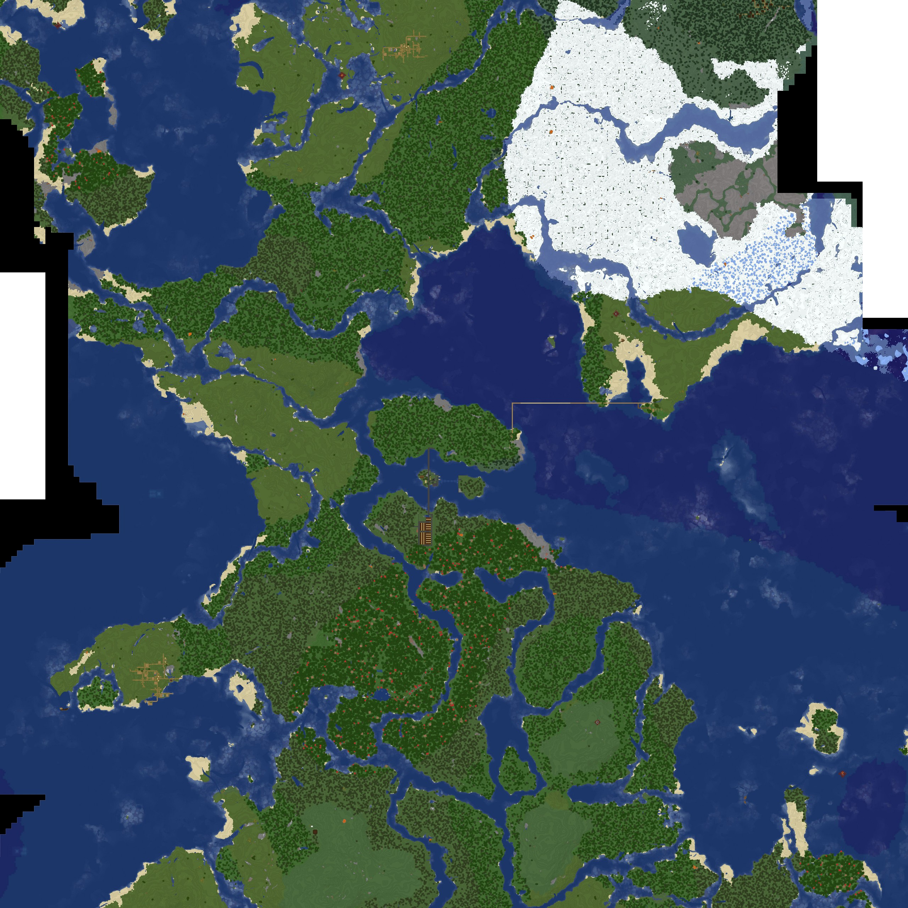

# McDynMapTimelapse

Example configuration

```json
{
  "Url": "http://10.0.0.110:8123/",
  "WorldName": "world",
  "MapName": "flat",
  "TargetDir": "C:\\temp\\mctimelapse\\img3",
  "CenterPos": {
    "X": 456,
    "Y": 64,
    "Z": -1880
  },
  "SizeW": 10,
  "SizeH": 10,
  "Zoom": 2,
  "Enabled": true,
  "ChangeFactor": 0.005
}
```

Example output
